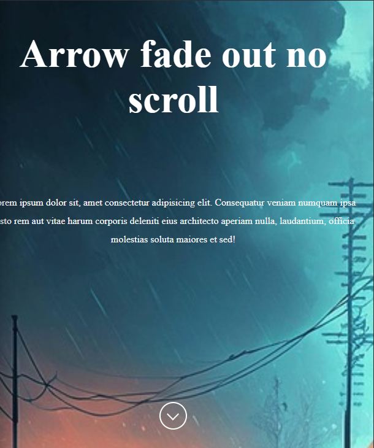

# arrow-fade-out
An arrow that fade out when you scrollY when the position is less than/equal to 5
# arrow-fade-out

A small JavaScript project that shows and hides an arrow based on the scroll position of the window.

## Features
- Displays an arrow at the top of the page.
- The arrow **fades in** when the scroll position is at the very top (`scrollY <= 5`).
- The arrow **fades out** once you start scrolling down.

